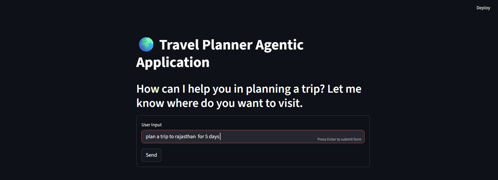
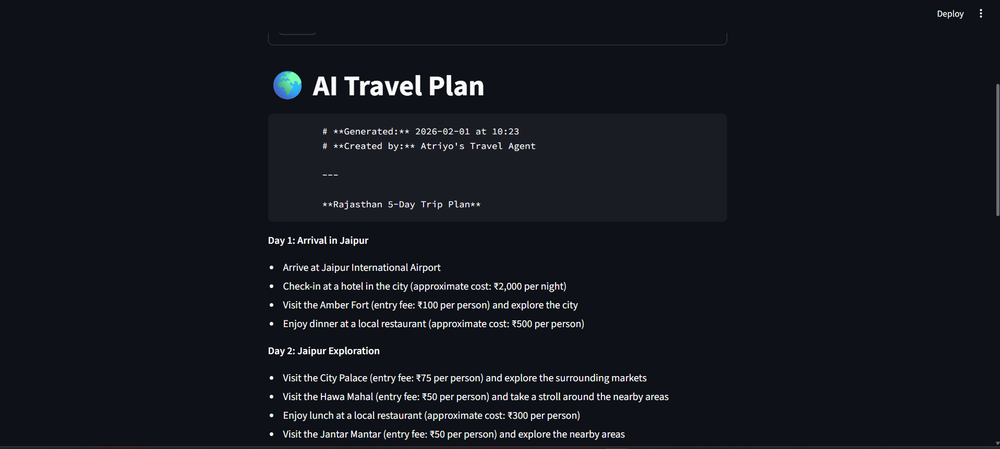
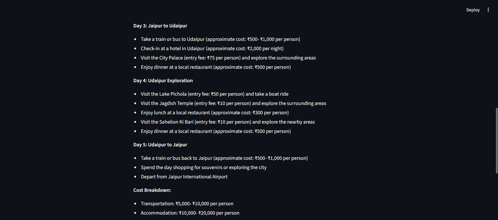
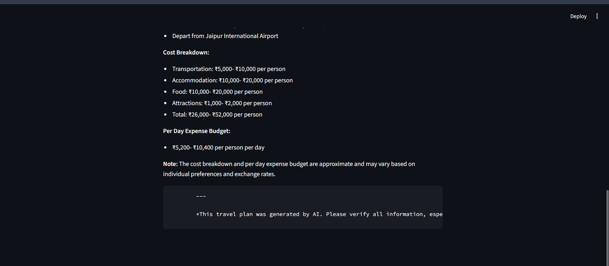

# 🌍 AI Travel Planner - Agentic LLMOps Application

> **"Your personal AI travel agent that plans, calculates, and guides."**
> An autonomous agentic workflow designed to generate comprehensive travel itineraries, calculate real-time budgets, and check live weather conditions using a suite of integrated APIs.


---

## 📸 Application Preview

The application provides a seamless chat interface where users can request travel plans. The agent autonomously reasons, calls multiple tools, and generates a structured response.

### 1. User Input & Agent Reasoning
The user provides a high-level request. The agent analyzes the destination, duration, and requirements before initiating its toolchain.

| **User Request** | **Agent Reasoning** |
|:---:|:---:|
|  |  |
| *User asks: "Plan a trip to Rajasthan for 5 days"* | *Agent initializes tools & drafts Day 1-2* |

### 2. Complete Itinerary & Budgeting
The agent generates a day-by-day breakdown, including specific tourist spots, transport options, and a final estimated budget per person.

| **Detailed Itinerary** | **Financial Breakdown** |
|:---:|:---:|
|  |  |
| *Complete day-wise plan with logistics* | *Real-time cost estimation per person* |

---

## 📖 Overview

This project is a sophisticated **Agentic AI Application** built to solve the complex problem of travel planning. Unlike simple chatbots, this agent uses **LangGraph** to maintain state, reason about the user's request, and autonomously decide which external tools to use.

It features a complete **End-to-End LLMOps Pipeline**:
1.  **Development:** Modular Python tools for Search, Weather, and Math.
2.  **Containerization:** Dockerized architecture separating Backend (FastAPI) and Frontend (Streamlit).
3.  **Observability:** Integrated with **LangSmith** for real-time tracing of agent thoughts and tool outputs.
4.  **Deployment:** Cloud-native deployment strategy using **AWS ECR (Registry)** and **AWS ECS Fargate (Serverless Compute)**.

---

## ✨ Key Features

* **🧠 Cognitive Agent:** Uses a "ReAct" (Reasoning + Acting) loop to break down complex queries (e.g., "Plan a trip AND calculate budget").
* **🛠️ Multi-Tool Arsenal:**
    * **Foursquare & Tavily:** For finding rated attractions, hotels, and hidden gems.
    * **OpenWeatherMap:** To check forecast compatibility for the trip dates.
    * **Currency Converter:** Real-time exchange rates (USD to INR, EUR, etc.).
    * **Expense Calculator:** Built-in logic for accurate trip budgeting.
* **⚡ High-Performance LLM:** Powered by **Groq (Llama-3.1-8b-instant)** for sub-second inference speeds, ensuring a snappy UI.
* **📊 LLMOps & Observability:** Full integration with **LangSmith** to debug agent hallucinations and optimize token usage.
* **☁️ Cloud Native:** Designed for **AWS Fargate**, ensuring scalability without managing servers.

---

## 🛠️ Tech Stack

| Category | Technology Used |
| :--- | :--- |
| **Language** | Python 3.12 |
| **Orchestration** | LangGraph, LangChain |
| **LLM Provider** | Groq (Llama-3), OpenAI (Optional) |
| **Backend** | FastAPI |
| **Frontend** | Streamlit |
| **Containerization** | Docker |
| **Cloud & DevOps** | AWS (ECR, ECS, Fargate), GitHub Actions |
| **Observability** | LangSmith |

---

## 📂 Folder Structure

The project follows a modular "Microservice-lite" structure, separating the Agent Brain, Tools, and Interface.

```bash
TRIP_PLANNER_AGENTICAI/
├── agent/
│   ├── __init__.py
│   └── agentic_workflow.py    # 🧠 The Brain: LangGraph State Machine & Node Logic
├── config/
│   └── config.yaml            # ⚙️ Configuration for Model selection (Groq vs OpenAI)
├── demo/                      # 📸 Screenshots for README
│   ├── ai1.png
│   ├── ai2.png
│   ├── ai3.png
│   └── ai4.png
├── tools/                     # 🛠️ The Toolbelt (Deprecated folder, moved to utils)
├── utils/                     # 🧰 Core Utilities & Tools
│   ├── config_loader.py       # Securely loads .env & YAML configs
│   ├── model_loader.py        # Dynamic LLM initialization
│   ├── place_info_search.py   # Wrapper for Foursquare & Tavily Search
│   ├── weather_info.py        # Wrapper for OpenWeatherMap
│   ├── currency_converter.py  # Real-time Currency Exchange
│   └── expense_calculator.py  # Math Logic for Budgeting
├── frontend/
│   └── streamlit_app.py       # 💻 UI: Streamlit Chat Interface
├── main.py                    # 🚀 Entrypoint: FastAPI Backend Server
├── Dockerfile                 # 🐳 Docker: Multi-stage build instruction
├── requirements.txt           # 📦 Dependencies
└── .env                       # 🔐 Secrets (API Keys - Not committed)


👨‍💻 Development Workflow
If you want to contribute or modify the agent's behavior, follow this modular workflow:

Update Configuration: Modify config/config.yaml to switch models or adjust temperature.

Add a New Tool:

Create a new file in utils/.

Define a class with @tool decorators.

Register it in agent/agentic_workflow.py.

Refine the Brain: Update the GraphBuilder class in agent/agentic_workflow.py to change how the agent loops or decides.

Test Locally: Run the diagnostic script test_agent.py to verify logic before launching the UI.

Monitor: Use LangSmith to check traces if the agent fails to use the new tool correctly.

🚀 How to Run Locally
Prerequisites
Python 3.10+

Docker (Optional, for container run)

API Keys for Groq, Tavily, Foursquare, OpenWeather.

1. Installation
Clone the repository and set up the environment.

Bash

git clone [https://github.com/your-username/AI_Trip_Planner.git](https://github.com/your-username/AI_Trip_Planner.git)
cd AI_Trip_Planner

# Create Virtual Environment
python -m venv .venv
source .venv/bin/activate  # Windows: .venv\Scripts\activate

# Install Dependencies
pip install -r requirements.txt
2. Configuration (.env)
Create a .env file in the root directory. This is critical for the agent to function.

Ini, TOML

# --- Model Providers ---
GROQ_API_KEY="gsk_..."
OPENAI_API_KEY="sk_..." (Optional)

# --- Tool APIs ---
TAVILY_API_KEY="tvly-..."
OPENWEATHERMAP_API_KEY="3a1d..."
FOURSQUARE_API_KEY="fsq3..."
EXCHANGE_RATE_API_KEY="b01e..."

# --- LLMOps (LangSmith) ---
LANGCHAIN_TRACING_V2=true
LANGCHAIN_API_KEY="lsv2_..."
LANGCHAIN_PROJECT="Travel-Planner-Agent"
3. Run the Application
You need to run the Backend and Frontend simultaneously.

Terminal 1: Start Backend (FastAPI)

Bash

uvicorn main:app --reload --port 8000
Server will start at http://localhost:8000

Terminal 2: Start Frontend (Streamlit)

Bash

streamlit run frontend/streamlit_app.py
Access the UI at http://localhost:8501

☁️ LLMOps & Cloud Deployment (AWS)
This project is designed for a robust LLMOps lifecycle. Here is how we deploy it to the cloud.

1. Docker Build (The Artifact)
We package the entire application (Frontend + Backend) into a single container image.

Bash

# Build the image
docker build -t trip-planner-agent .

# Test container locally
docker run -p 8000:8000 -p 8501:8501 --env-file .env trip-planner-agent
2. Push to AWS ECR (The Registry)
Store the image securely in AWS Elastic Container Registry.

Bash

# Login to AWS ECR
aws ecr get-login-password --region us-east-1 | docker login --username AWS --password-stdin [YOUR_ACCOUNT_ID].dkr.ecr.us-east-1.amazonaws.com

# Tag the image
docker tag trip-planner-agent:latest [YOUR_ACCOUNT_ID][.dkr.ecr.us-east-1.amazonaws.com/trip-planner-repo:latest](https://.dkr.ecr.us-east-1.amazonaws.com/trip-planner-repo:latest)

# Push
docker push [YOUR_ACCOUNT_ID][.dkr.ecr.us-east-1.amazonaws.com/trip-planner-repo:latest](https://.dkr.ecr.us-east-1.amazonaws.com/trip-planner-repo:latest)
3. Deploy to AWS ECS Fargate (The Runtime)
Create Task Definition: Select Fargate, 2GB RAM, 1 vCPU.

Add Container: Point to the ECR Image URI.

Environment Variables: Add all .env keys (GROQ_API_KEY, etc.) into the container definition.

Port Mapping: Expose ports 8501 (UI) and 8000 (API).

Launch Service: Create a Service to keep the task running.

Access: Use the Public IP of the task: http://[PUBLIC_IP]:8501.

📡 Observability with LangSmith
Debugging autonomous agents is difficult. We use LangSmith to trace every step of the execution.

Traces: See the exact input/output of every tool call (e.g., "Did the Weather API return a 404?").

Token Usage: Monitor costs per query.

Latency: Identify bottlenecks in the workflow.

(Example: If the agent says "I can't find hotels," check the LangSmith trace to see if the Foursquare API call failed or returned empty results.)

👨‍💻 Author
prakash saini

Role: AI Engineer / MLOps Practitioner

Focus: Agentic AI, LLMOps, Cloud Architecture